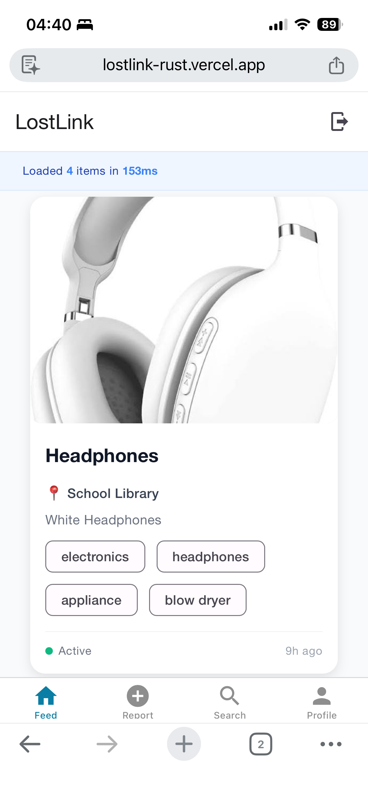
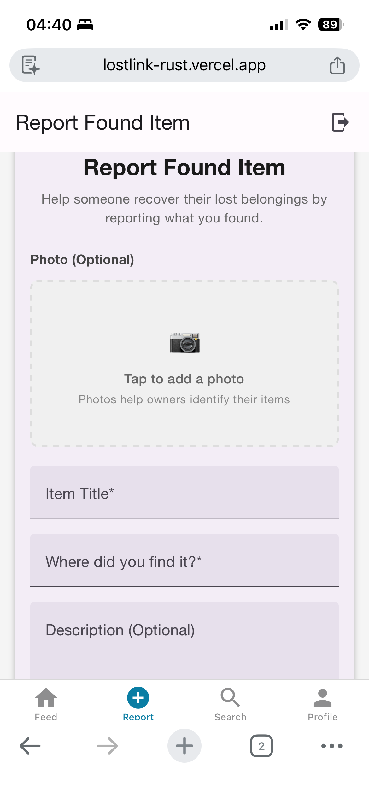
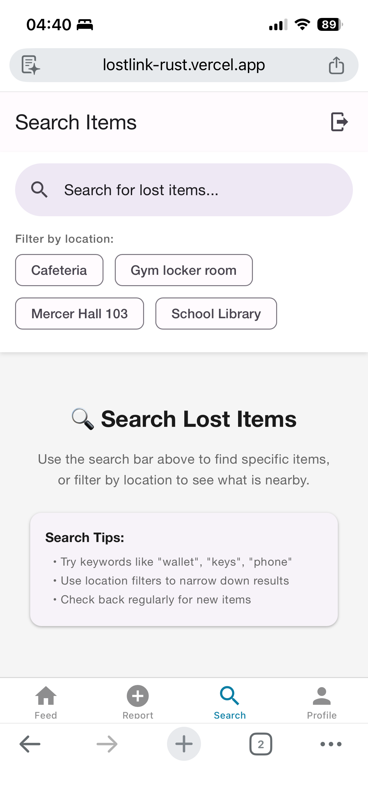
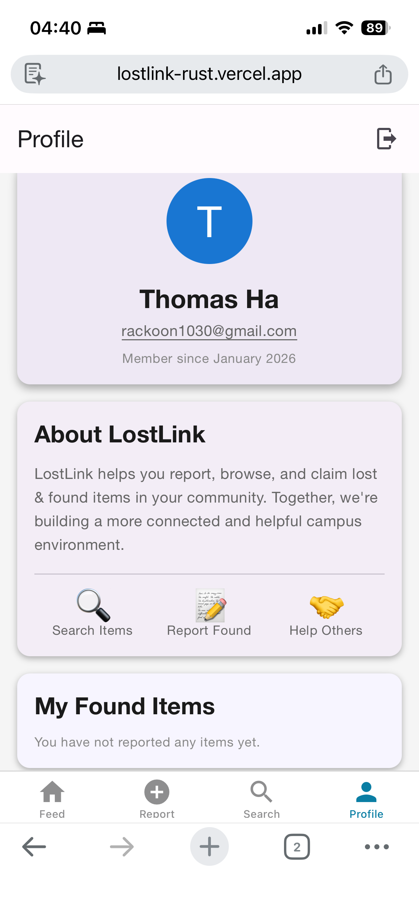

# LostLink

**Lost & Found Platform** | AI Image Tagging | Authentication System

[](https://lostlink-rust.vercel.app/landing)

**Tech Stack:** React Native / Expo • Node.js / Express • EC2 + Nginx • MongoDB Atlas • Auth0 • AWS S3 • AWS Rekognition • Resend

---

## Demo Videos

| Feature | Demo |
|---------|------|
| **Claim Flow** | [](https://www.youtube.com/watch?v=t_Ym0O9VG6U) |
| **Report Item** | [](https://www.youtube.com/watch?v=Hn62M99SXIo) |
| **Search Feature** | [](https://www.youtube.com/watch?v=fPnVUFPhOA0) |

---

## Screenshots

<div align="center">
  
  
  
  
</div>

---

## Features

• **AI Image Tagging** - Automatic image tagging and search with AWS Rekognition  
• **Secure Authentication** - Auth0-based JWT authentication  
• **CRUD Operations** - Item registration, search, update, and status workflow  
• **Email Notifications** - Claim notifications via Resend/SendGrid  
• **Image Storage** - Image upload and storage with AWS S3  
• **Deployed Architecture** - Frontend/backend split deployment (Vercel + EC2/Nginx)

---

## Architecture

• **Frontend:** Vercel (React Native Web)  
• **Backend:** EC2 + Nginx reverse proxy + HTTPS  
• **Database:** MongoDB Atlas  
• **Storage:** AWS S3 (MinIO for local dev)  
• **AI Service:** AWS Rekognition

---

## What I Learned

Implemented CORS configuration and cookie-based authentication flow, managed environment variables and secrets securely, configured Nginx reverse proxy with SSL certificates, and debugged 401/500 errors in production environments. Gained hands-on experience with Docker Compose for local development, MongoDB Atlas connection management, and deploying full-stack applications with proper separation of concerns.

---

## Running Locally

### Option 1: Docker Compose (Recommended)

```bash
# Start backend + DB services
docker compose up -d

# Frontend (separate terminal)
cd frontend && npm install
npx expo start --host lan -p 19001 --web
```

**Services:** Backend (5001), MongoDB (27017), MinIO (9000), Mongo Express (8081)

### Option 2: Local Development

```bash
# Backend
cd backend && npm install
# Set .env with required variables (see below)
npm run dev

# Frontend
cd frontend && npm install
# Set EXPO_PUBLIC_API_URL in .env
npx expo start --web
```

### Environment Variables

**Backend `.env`:**
```
MONGO_URI=mongodb://localhost:27017/lostlink  # or MongoDB Atlas URI
AUTH0_DOMAIN=your-auth0-domain
AUTH0_AUDIENCE=https://lostlink-api
RESEND_API_KEY=re_your-key
FROM_EMAIL=your-email@example.com
AWS_ACCESS_KEY_ID=your-key
AWS_SECRET_ACCESS_KEY=your-secret
AWS_REGION=us-west-2
# For local MinIO
MINIO_ENDPOINT=http://localhost:9000
MINIO_ACCESS_KEY=minioadmin
MINIO_SECRET_KEY=minioadmin
MINIO_BUCKET_NAME=lostlink-uploads
MINIO_PUBLIC_URL=http://localhost:9000
```

**Frontend `.env`:**
```
EXPO_PUBLIC_API_URL=http://localhost:5001
EXPO_PUBLIC_AUTH0_DOMAIN=your-auth0-domain
EXPO_PUBLIC_AUTH0_CLIENT_ID=your-client-id
EXPO_PUBLIC_AUTH0_REDIRECT_URI=http://localhost:8081
EXPO_PUBLIC_AUTH0_AUDIENCE=https://lostlink-api
```

**Required Services:** MongoDB Atlas (or local), Auth0, AWS (S3 + Rekognition), Resend/SendGrid

---

## Deployment

### Frontend (Vercel)
```bash
cd frontend
npm run build:web
vercel --prod
```
Set environment variables in Vercel dashboard.

### Backend (EC2 + Nginx)
1. Build Docker image: `docker compose build backend`
2. Deploy to EC2 with Nginx reverse proxy
3. Configure SSL with Let's Encrypt
4. Set production environment variables

---

MIT License © 2025 Ben Hurst & Thomas Ha
